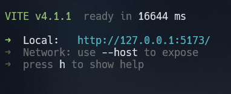

# Takever front end test

## Pokedex consuming pokeapi

### Description

This test was made to show my front end skills to Takever company, as a first step for the front end job interview.

Here you will see how I've consumed and rendered the data from the [PokeApi]('https://pokeapi.co/api'), make the pagination to show all the 1279 existing pokemons, in step by 20, and render some information about then in another screen.

### Techs used

To work in this project, I've choose the follow technologies:
  
- [React](https://reactjs.org) - Mandatory;
- [Vite](https://vitejs.dev) - to create the react environment;
- [Styled components](https://styled-components.com) - To style and make all the components better to human read;
- [React Router Dom v6](reactrouter.com/) - To navigate between pages, and
- [Axios](https://axios-http.com/) - To consume the api and create the base Url to be user in all components

### How to run the application locally

To run the application locally you should first clone the repo. In order to do this, you need to open your terminal, choose where you want to clone the repo, then run :
`git clone https://github.com/Ceagah/takever-front-end-test.git`  
or  
`git@github.com:Ceagah/takever-front-end-test.git`  

Then you need to get into this new folder in your local machine, just typing:
`cd takever-front-end-test`  

Once you're into the test folder, you should install all the dependencies packages running
`yarn`  
or  
`npm i` or `npm install`

When the dependencies are installed, you should run the last command at the terminal, that is :
`yarn dev`  
or  
`npm run dev`  

This command will run the the application, and opening the [localhost](https://127.0.0.1:5173) at the port ***5173***
  
You just need to open your browser and access this link, and you will navigate through the application. YOU'RE IN !

### Test Check list

[x] Use React  
[x] Use React hooks, router and state management  
[x] Consume Api  
[x] Create all pages and components  
[x] Create pagination  
[x] Handle fav pokemons  
[x] Use localStorage to handle fav pokemons  
[x] Add comment in code, to explain some parts  
[x] Responsive application  
[x] Create a README with some information about the test  
[ ] Unit tests.  

### Final Thoughts

This code test is challenging at the point that i should consume the pokemon api. This api is very well structured, and there is a lot of information. To render all the data, you should pass some parameters to the componentes, render them , and later show it.
To render the pokemon data, you should dive into the props coming from the api, there is a lot of objects into other objects. BUT at the end, it's real cool and I 've learned a lot with it.